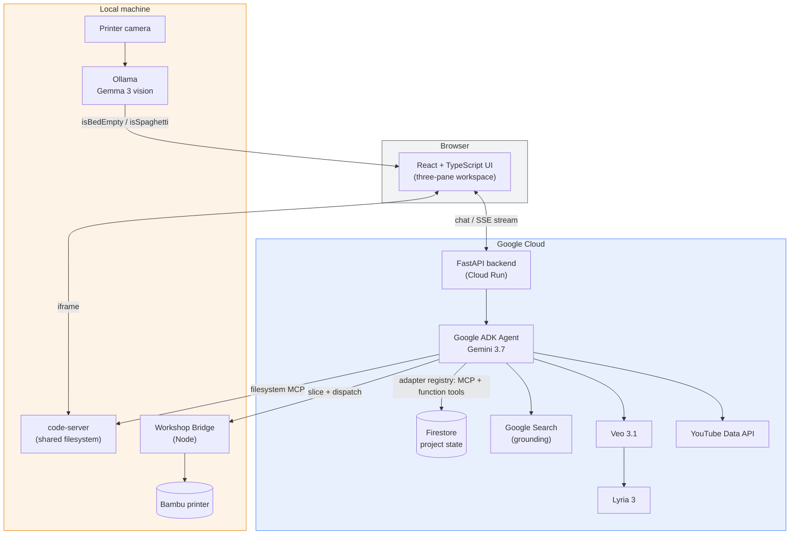

<div align="center">

# ⚒️ Anvil

### An AI engineering partner that designs, wires, codes, and prints real hardware — with you, not for you.

*All Things Agentic Hackathon 2026 · Collaborative Partner track*

[](https://ai.google.dev/)
[](https://google.github.io/adk-docs/)
[](https://cloud.google.com/run)
[](https://firebase.google.com/docs/firestore)

[](https://deepmind.google/technologies/veo/)
[](https://deepmind.google/technologies/lyria/)
[](https://ai.google.dev/gemma)
[](#)
[](https://github.com/Its-a-me-Ashwin/Anvil/commits/main)
[](#)

</div>

<br>

<div align="center">

| [🧩 The problem](#the-problem) | [✨ What it does](#what-it-does) | [🏗️ Architecture](#architecture) | [🧠 Google stack](#google-stack) | [🚀 Getting started](#getting-started) | [📁 Structure](#project-structure) |
|:---:|:---:|:---:|:---:|:---:|:---:|

</div>

---

## The problem

Building real hardware means living in fifteen tabs at once — a CAD tool, a
datasheet PDF, a parts search, a slicer, a printer dashboard, a forum thread
for the one wiring gotcha nobody documented. None of those tools know about
each other, or about *your* project. You are the integration layer, and
every context switch costs you the thread you were holding.

<table>
<tr><th align="center">Without Anvil</th><th align="center">With Anvil</th></tr>
<tr><td>

- Open a CAD tool, model by hand
- Search for a datasheet, lose ten minutes
- Draw wiring on paper or forget to
- Write firmware from a blank file
- Slice separately, walk to the printer
- Nothing remembers what you decided

</td><td>

- Describe the part, Anvil models it
- Datasheet auto-attaches when you log the part
- Wiring diagram generated on request
- Firmware written into your shared workspace
- Slice → dispatch → watched by local vision
- Every constraint and decision persists in Firestore

</td></tr>
</table>

**Anvil is the integration layer.** One agent holds your project's state —
goals, locked constraints, the parts you own, your own skill level — and
*acts* on it. Not a chatbot that answers questions about hardware. A partner
that does the hardware work next to you, and remembers what it did.

<a id="what-it-does"></a>
## ✨ What Anvil does

<details open>
<summary><b>🧠 Understands and remembers the project</b></summary>
<br>

| Capability | How |
|---|---|
| **Holds durable project state** | Objective, locked/flexible constraints, inventory, milestones, decisions, and a per-category skill profile — all in Firestore, injected back into every turn |
| **Calibrates to your skill level** | Asks one short calibration question at setup, then adjusts explanation depth per category from then on |
| **Guides the build in stages** | Tracks **Project Setup → CAD Design → Wiring → Firmware & Code → Slicing & Printing → Review**, checking each off as the work actually happens |
| **Grounds its answers** | Falls back to Gemini's built-in Google Search only when project state doesn't already have the answer |

</details>

<details open>
<summary><b>🛠️ Designs and builds the hardware</b></summary>
<br>

| Capability | How |
|---|---|
| **Builds parametric CAD** | Composes real multi-part assemblies (tubes, cones, prisms, booleans, fillets, circular patterns) via `build123d` — not a single stacked primitive |
| **Draws wiring diagrams** | Module-level schematics — power, ground, buses — rendered natively, not hand-drawn |
| **Writes real code** | Edits the same project files open in an embedded VS Code (code-server), scoped to a per-project sandbox |
| **Auto-attaches datasheets** | Logging an electronics part pulls its Adafruit datasheet into Data Sources with no extra step |

</details>

<details open>
<summary><b>🎬 Explains things a spec sheet can't</b></summary>
<br>

| Capability | How |
|---|---|
| **Finds a real tutorial first** | Searches YouTube before generating anything — free and trustworthy beats synthetic |
| **Generates what no tutorial covers** | A Veo animation with a Lyria-composed instrumental score, muxed automatically, only when asked or when nothing else exists |

</details>

<details open>
<summary><b>🖨️ Crosses into the physical world</b></summary>
<br>

| Capability | How |
|---|---|
| **Slices and prints for real** | Sends a sliced model to an actual Bambu printer through a decoupled local Workshop Bridge |
| **Watches the print locally** | A local Gemma 3 vision model (via Ollama) monitors the camera feed — no cloud round-trip needed for that loop |

</details>

### A build, stage by stage

Every new project is scaffolded with the same six milestones, and Anvil
checks each one off the moment that stage's real work happens — not on
request:

```
Project Setup  ──▶  CAD Design  ──▶  Wiring  ──▶  Firmware & Code  ──▶  Slicing & Printing  ──▶  Review & Handoff
     ●                  ●               ●               ○                     ○                        ○
   done               done            done          in progress             next                    next
```

### A typical session

```
you   › I'm building a Level 2 cert rocket. Lower airframe's done — carbon
        tube, 66mm ID, 67mm OD, 38mm motor mount. I have 2× RP2040 boards
        with LoRa, an MPU6050, a BMP390, and a UART GPS. Set up the project.

anvil › [set_project_objective] [add_constraint × 1, locked] [add_inventory_item × 4]
        [add_objective × 6]
        Locked your tube dimensions and logged your avionics. Quick
        calibration so I pitch things right — how comfortable are you with
        embedded firmware, versus CAD?

you   › Solid on CAD, I built the lower airframe myself. Newer to firmware.

anvil › [set_skill_level: CAD & Mechanical Design → 4/5]
        [set_skill_level: Firmware & Embedded Coding → 2/5]
        Got it — I'll go deeper on the firmware side. Ready for the upper
        airframe and avionics bay whenever you are.
```

<a id="architecture"></a>
## 🏗️ Architecture

Anvil is five decoupled services, not a monolith. The agent never talks to
hardware directly — it calls narrowly-scoped tools, and a local bridge owns
the machine.



**Design decisions that matter for judging**

- **One adapter registry, two tool backings.** Every capability the agent can
  touch is declared once in [`backend/adapters/registry.py`](backend/adapters/registry.py)
  — MCP toolsets (filesystem) and native Python function tools (CAD, circuit,
  printer, state, animation, datasheet, YouTube) are wired from the same list,
  so nothing reaches the model without an explicit, narrowly-scoped entry.
- **Per-tool error boundaries.** Custom function tools are wrapped so a raised
  exception becomes a normal tool-call error the model can react to, instead
  of aborting the whole in-flight chat request.
- **The agent never touches hardware directly.** Slicing and printer control
  go through a **decoupled local Workshop Bridge** — the cloud backend can
  restart, redeploy, or fail without taking the printer connection down with
  it.
- **Cloud/local model routing.** Gemini 3.7 reasons in the cloud; a **local
  Gemma 3** model handles printer-camera vision over Ollama, so the one loop
  that needs low-latency, always-on inference doesn't round-trip to the cloud.
- **State outlives the session.** Every meaningful fact — constraints,
  inventory, decisions, skill profile — is written to Firestore as it's
  learned, not held in a chat buffer, and read back into the system
  instruction on every turn.

<details>
<summary><b>Full adapter / tool inventory</b> (from <code>backend/adapters/registry.py</code>)</summary>
<br>

| Adapter | Backing | What it exposes |
|---|---|---|
| `filesystem` | MCP | Read, write, edit, search, and list files in the active project's sandbox |
| `cad` | Function tools | `build123d` primitives, booleans, fillets/chamfers, patterns, export |
| `circuit` | Function tools | Create / read / update / delete wiring diagrams |
| `printer` | Function tools | Register printers, slice via Bambu Studio, dispatch a print job |
| `state` | Function tools | Objective, constraints, inventory, milestones, decisions, skills, data sources |
| `animation` | Function tools | Veo generation + Lyria scoring, muxed automatically |
| `youtube_search` | Function tools | Real tutorial lookup via YouTube Data API v3 |
| `datasheet` | Function tools | Adafruit datasheet resolution for electronics parts |
| — | Built-in ADK tool | `google_search` grounding |

</details>

<a id="google-stack"></a>
## 🧠 The Google AI & Cloud stack

| Piece | Role |
|---|---|
| **Gemini 3.7** | Agent reasoning, tool orchestration |
| **Google ADK** | Agent framework — `MCPToolset` + `FunctionTool` wiring |
| **Firestore** | Project state, decisions, inventory, skill profile |
| **Cloud Run** | Backend hosting |
| **Gemma 3 (4B)** | Local printer-camera vision, via Ollama |
| **Veo 3.1** | On-demand explainer animation generation |
| **Lyria 3** | Instrumental score generation, muxed into Veo clips |
| **Google Search grounding** | Fallback for questions project state can't answer |
| **YouTube Data API v3** | Finds real tutorials before generating synthetic ones |

## 🧰 Tech stack

**Frontend**

[](https://react.dev/)
[](https://www.typescriptlang.org/)
[](https://vitejs.dev/)
[](https://tailwindcss.com/)
[](https://github.com/pmndrs/zustand)

**Backend**

[](https://www.python.org/)
[](https://fastapi.tiangolo.com/)
[](https://google.github.io/adk-docs/)
[](https://ai.google.dev/)
[](https://github.com/gumyr/build123d)
[](https://docs.pydantic.dev/)

**Infra & Cloud**

[](https://cloud.google.com/)
[](https://cloud.google.com/run)
[](https://firebase.google.com/docs/firestore)
[](https://www.docker.com/)

**Local tooling & models**

[](https://nodejs.org/)
[](https://ollama.com/)
[](https://ai.google.dev/gemma)
[](https://deepmind.google/technologies/veo/)
[](https://deepmind.google/technologies/lyria/)
[](https://developers.google.com/youtube/v3)
[](https://github.com/coder/code-server)
[](https://modelcontextprotocol.io/)

<a id="getting-started"></a>
## 🚀 Getting started

Anvil runs as five services. See [`local-deploy.md`](local-deploy.md) for the
full walkthrough — short version:

```bash
# 1. Frontend + root tooling
npm install
cd frontend && npm install && cd ..

# 2. Backend (Python 3.10+)
cd backend
python3.12 -m venv .venv
.venv/bin/pip install -r requirements.txt
cp .env.example .env   # fill in GEMINI_API_KEY at minimum
cd ..

# 3. Start everything
./anvil-run --start
```

Then open **http://localhost:5173**. `./anvil-run --status` shows what's
running; `./anvil-run --stop [service]` stops one service, or all of them.

| Service | Port | Purpose |
|---|---|---|
| Frontend | `5173` | The three-pane workspace |
| Backend API | `8000` | Chat, tools, project state — `/health` reports live tool count |
| Workshop Bridge | `3001` | Printer + slicer proxy |
| Code server | `8080` | Browser VS Code, scoped to the active project |
| Firestore emulator | `8200` | Local project state DB |

## ☁️ Deploy to Google Cloud

Full instructions — enabling APIs, standing up Firestore, building and
deploying the container, wiring IAM — are in [`deploy.md`](deploy.md).
Short version:

```bash
cd backend
gcloud builds submit --tag gcr.io/YOUR_PROJECT_ID/anvil-backend
gcloud run deploy anvil-backend \
  --image gcr.io/YOUR_PROJECT_ID/anvil-backend \
  --set-env-vars GEMINI_API_KEY=...,GOOGLE_CLOUD_PROJECT=... \
  --allow-unauthenticated --port 8080
```

`curl https://<your-service>.run.app/health` should return
`{"status":"ok","tools":N}` — that response is the "backend running on
Google Cloud" proof the submission asks for.

<a id="project-structure"></a>
## 📁 Project structure

```
Anvil/
├── frontend/                 React + TypeScript UI
│   └── src/
│       ├── components/       Workspace panes, tool-call cards, wiring diagram
│       ├── services/         Typed API clients per capability
│       └── store/             Zustand stores (project, workspace, activity)
├── backend/
│   ├── agent.py               Wires adapters/registry.py into a Google ADK Agent
│   ├── server.py               FastAPI: chat sessions, streaming, project state
│   └── adapters/
│       ├── registry.py         Single source of truth — every tool the agent can touch
│       ├── cad/                 Parametric assemblies (build123d)
│       ├── circuit/             Wiring diagram CRUD
│       ├── printer/             Slice + dispatch via the Workshop Bridge
│       ├── state/               Firestore-backed project state
│       ├── animation/           Veo + Lyria generation
│       ├── youtube_search/      Tutorial lookup
│       ├── datasheet/           Adafruit datasheet resolution
│       └── filesystem/          MCP server params (shared with code-server)
├── server/
│   └── workshopBridge.mjs      Local printer/slicer bridge — decoupled from the cloud backend
├── deploy.md                    Cloud Run + Firestore deployment guide
└── local-deploy.md              Full local spin-up walkthrough
```

## 🤝 Why Collaborative Partner

Anvil doesn't wait for a fully-specified command and execute it once. It
**synthesizes** the project's state as the conversation reveals it, **asks**
when it needs a signal it doesn't have (the skill calibration question),
**guides** the build through named stages with visible progress, and
**gates** irreversible actions — writing files, slicing, printing — behind
explicit approval unless told to proceed. That loop, not a single automated
task, is the thing being submitted.

---

<div align="center">

Built during **All Things Agentic Hackathon 2026**.

</div>  
